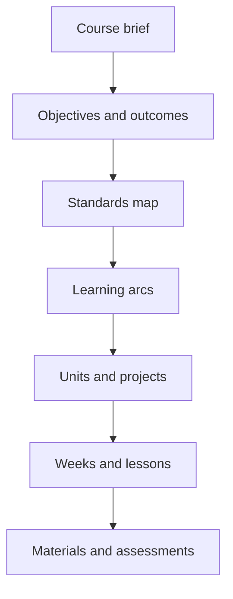
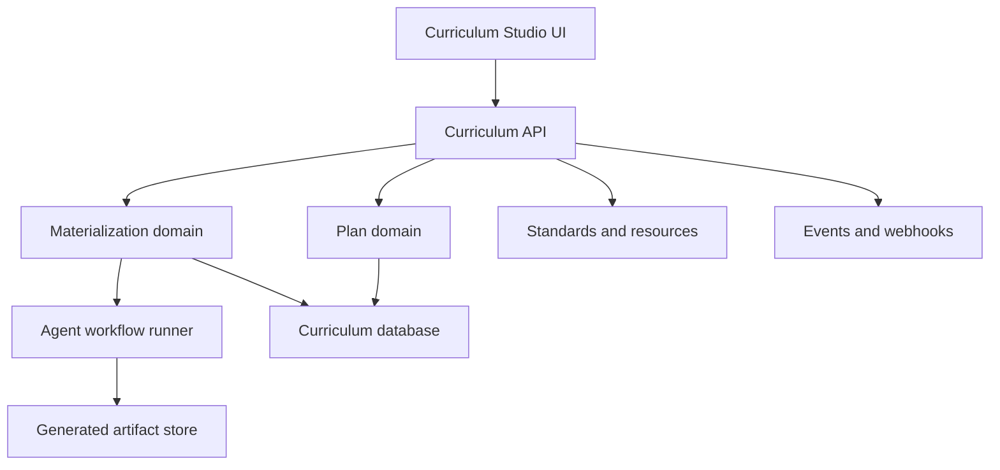

# Primer Curriculum Studio

## Standalone Product and Primer Ecosystem Plan

> **Foundation crosswalk (cite for integration work):** [curriculum-studio-foundation-crosswalk.md](./curriculum-studio-foundation-crosswalk.md) freezes service/DB/auth/contract ownership after the four foundation artifacts were reconciled.

## Product concept

Build the curriculum planning tool as a standalone **Curriculum Studio**: a planning and lesson-production product for teachers and homeschool parents, with Primer acting as one consumer of its APIs.

The key product boundary is:

> Curriculum Studio owns what should be taught and the concrete instructional materials derived from it. Primer owns the live student experience, mastery state, tutoring, and session execution.

## Product value proposition

A teacher or parent should be able to use Curriculum Studio without running the rest of Primer to:

- Turn broad goals into measurable outcomes
- Align outcomes with standards
- Build a prerequisite-aware scope and sequence
- Organize units, projects, readings, media, and assessments
- See standards coverage and gaps
- Generate concrete lesson plans and learning materials
- Revise generated content without losing the high-level plan
- Export printable or LMS-friendly artifacts
- Re-materialize part of a course when requirements change

The basic user experience should feel like progressively zooming in:



At every level, the user can approve, edit, regenerate, lock, or drill down.

## Product boundary

### Curriculum Studio owns

- Curriculum plans and revisions
- Objectives and learning outcomes
- Standards catalogs and mappings
- Prerequisite graphs
- Scope and sequence
- Unit and project blueprints
- Curated resource references
- Materialization workflows
- Generated lessons, assignments, assessments, and rubrics
- Coverage and validation reports
- Export and publishing

### Curriculum Studio does not own

- Student conversations
- Live tutoring
- Student submissions
- Authoritative mastery records
- Session orchestration
- Grades or transcripts
- Portfolio storage
- Parent notifications

Standalone users can provide a generic learner or class profile. Primer can provide current, authoritative learner state through the integration API.

## Core product concepts

### Workspace

A school, family, co-op, teacher, or curriculum-authoring organization.

### Curriculum

A durable identity such as “Grade 6 Integrated Curriculum” or “Algebra I.”

### Plan revision

An immutable version of the educational plan. It contains:

- Objectives
- Outcomes
- Standards mappings
- Prerequisites
- Learning arcs
- Units and projects
- Evidence requirements
- Scheduling policies
- Parent or teacher constraints

Draft revisions remain editable. Publishing creates an immutable revision.

### Materialization

A concrete production run against a plan revision:

```text
plan revision
+ learner/class profile
+ calendar window
+ resource availability
+ generation policy
= materialization
```

### Materialized item

A generated lesson, assignment, assessment, project task, discussion guide, media prompt, or teacher guide.

Users should be able to edit or lock individual items and then rematerialize the surrounding plan without losing those edits.

### Resource

A reference to a book, document, video, tool, project supply, or external URL. Curriculum Studio stores metadata and references; a separate content or artifact service may eventually own the actual files.

## Standalone product workflow

### 1. Create a curriculum brief

The user supplies:

- Grade or learner level
- Subjects
- Time horizon
- Academic goals
- Standards jurisdiction
- Available hours
- Books and resources
- Desired projects
- Testing requirements
- Educational philosophy and non-negotiables

Provide templates for common cases:

- Homeschool year
- Single-subject course
- Classroom semester
- Project-based unit
- Standards remediation plan

### 2. Generate the outcome map

An agent proposes:

- High-level objectives
- Observable outcomes
- Mastery criteria
- Standards mappings
- Prerequisites

The UI emphasizes review and approval rather than presenting generated content as settled fact.

### 3. Build the scope and sequence

The system groups outcomes into learning arcs and units. Users receive:

- Prerequisite warnings
- Coverage gaps
- Overloaded periods
- Unassessed outcomes
- Standards addressed only superficially
- Opportunities for cross-subject integration

### 4. Design units and projects

Each blueprint contains:

- Essential questions
- Target outcomes
- Prior knowledge
- Curated resources
- Instructional progression
- Project phases
- Required evidence
- Assessment plan
- Estimated effort
- Accommodation hooks

### 5. Materialize a window

The user chooses a unit, week, or date range and generates:

- Lesson sequence
- Teacher guides
- Student instructions
- Practice activities
- Discussion questions
- Worksheets
- Assessments and rubrics
- Project tasks
- Answer keys
- Printable packets

A homeschool parent might materialize the next two weeks. A classroom teacher might materialize an entire unit.

### 6. Publish or export

Initial exports should include:

- PDF/print packet
- Markdown
- DOCX
- CSV standards coverage report
- JSON bundle for Primer
- Calendar-friendly schedule

Later, add adapters for other LMSs without putting LMS-specific concepts into the curriculum domain.

## Primer integration contract

Primer should integrate through explicit service contracts rather than database access.

### Primer supplies

```yaml
materialization_context:
  plan_revision_id: planrev_123
  learner:
    id: learner_456
    grade: 6
    mastery_summary:
      TN.MATH.6.RP.A.3:
        status: approaching
        confidence: 0.74
    reinforcement_due:
      - TN.MATH.6.NS.B.3
    accommodations: []
  active_projects:
    - project_id: chicken-coop
      phase: design
  window:
    start: 2026-09-14
    available_minutes: 600
  overrides:
    pinned_outcomes:
      - TN.MATH.6.RP.A.3
```

### Curriculum Studio returns

```yaml
materialization_bundle:
  id: mat_789
  plan_revision_id: planrev_123
  context_fingerprint: sha256:...
  sessions:
    - id: session_spec_001
      target_outcomes: [...]
      activities: [...]
      assessment_specs: [...]
      resource_refs: [...]
      tutor_context: {...}
      completion_criteria: [...]
      remediation_branches: [...]
```

Primer then converts those session specifications into live tutor interactions.

### Domain events

Publish events such as:

- `curriculum.created`
- `plan_revision.published`
- `materialization.requested`
- `materialization.ready`
- `materialization.failed`
- `materialized_item.superseded`
- `plan_change.proposed`

Primer can subscribe to these, but Curriculum Studio should also work synchronously through its API.

## Service architecture

Initially implement Curriculum Studio as one independently deployable service with strong internal modules, rather than as a fleet of small services.



### Internal modules

| Module | Responsibility |
| --- | --- |
| Plan domain | Curriculum identity, revisions, graph editing, publication |
| Standards catalog | Standards, crosswalks, prerequisites, mastery criteria |
| Resource catalog | Books, media, projects, tools, metadata |
| Validation engine | Coverage, prerequisites, evidence, workload |
| Materialization domain | Runs, snapshots, generated items, provenance |
| Agent workflow runner | Decomposition, sequencing, generation, critique |
| Export service | PDF, DOCX, Markdown, JSON |
| Integration gateway | Events, webhooks, Primer adapter, machine JWT validation |
| MCP adapter | Authenticated Streamable HTTP MCP (`/mcp`) for curriculum-planning agents; tools call the same domain services as REST/gRPC |

These can become separate services only when scaling or ownership pressure justifies it.

### Agent MCP surface (planning agents)

External curriculum-planning agents connect to Curriculum Studio over **Streamable HTTP MCP** on the **same** Studio deployable:

- Endpoint: dedicated `/mcp` (not under REST `/studio/v1`); HTTPS in production
- Auth: per-request Bearer JWT from Primer Identity (`aud=curriculum-studio`); MCP never issues tokens
- Tools: workspace/curriculum discovery, standards/resource search, draft create, plan-graph read/patch, validate/findings, publish proposal; **publish/share/export destructive paths require human confirmation**
- Continuity: explicit opaque draft/resource IDs across calls — no implicit MCP protocol sessions in the initial revision
- Ownership detail: [`curriculum-studio-mcp-design.md`](./curriculum-studio-mcp-design.md)

MCP is a first-class **agent entrypoint** for draft planning on behalf of an authorized user. It does not replace the Studio UI governance loop or the Primer gRPC materialization contract.

## Agent workflow design

Use agents for judgment-heavy transformations and deterministic code for invariants.

### Agents

- Objectives Analyst
- Standards Mapper
- Sequence Architect
- Unit/Project Designer
- Assessment Designer
- Materializer
- Curriculum Critic

### Deterministic validation

Deterministic code should enforce that:

- Referenced standards exist
- The prerequisite graph is acyclic
- Every outcome has evidence criteria
- Generated items trace to a plan node
- Published revisions are immutable
- Locked user content cannot be overwritten
- Materializations record their complete input snapshot
- No assessment is published without an answer key or rubric

The workflow runner should persist every stage. A failed assessment-generation step should resume from that step rather than regenerate the entire unit.

## Product roadmap

### Phase 1: Useful planning MVP

Deliver standalone value quickly:

- Curriculum brief
- Objectives and outcome generation
- Standards import
- Plan graph
- Scope-and-sequence editor
- Coverage report
- Immutable plan revisions
- Markdown/PDF export

Avoid student accounts and live teaching.

### Phase 2: Unit materialization

- Unit blueprints
- Lesson generation
- Assessments and rubrics
- Editable and lockable generated items
- Materialization history
- DOCX and printable packets
- Generic learner/class profiles

At this point, it becomes a genuinely useful teacher product.

### Phase 3: Primer integration

- Materialization API
- Learner-state snapshot input
- JSON session bundles
- Webhooks and events
- Tutor context packs
- Reinforcement and remediation branches
- Primer adapter

### Phase 4: Projects and integrated curriculum

- Multi-subject project designer
- Project-phase materialization
- Off-screen activities
- Tool requirements
- Portfolio evidence specifications
- Cross-domain reinforcement planning
- Reading and media scheduling

### Phase 5: Collaborative authoring

- Shared workspaces
- Comments and approval
- Revision comparison
- Reusable unit library
- Plan templates
- Organization-specific standards and policies
- Selective curriculum sharing

### Phase 6: Authenticated MCP for planning agents

- Streamable HTTP MCP endpoint on the Studio deployable (`/mcp`)
- Identity-issued user/service JWTs; workspace-scoped tool authz
- Draft planning tools for agents (discover, search, graph patch, validate)
- Human-in-the-loop publish confirmation (never silent publish)
- Conformance with official MCP client + one external Streamable HTTP client

Detailed decisions: [`curriculum-studio-mcp-design.md`](./curriculum-studio-mcp-design.md). Platform Phase 19 / contracts Phase 12 / delivery waves `S19`/`C12`/`X7`.

## Most important product decision

Do not make the standalone product a watered-down view of Primer.

Curriculum Studio should have its own complete loop:

> plan → validate → materialize → edit → publish → export

Primer adds a second, adaptive loop:

> learner evidence → updated context → rematerialize → execute with tutors

This makes Curriculum Studio independently valuable while giving Primer a clean curriculum control plane instead of embedding curriculum-authoring logic inside the tutoring runtime.
