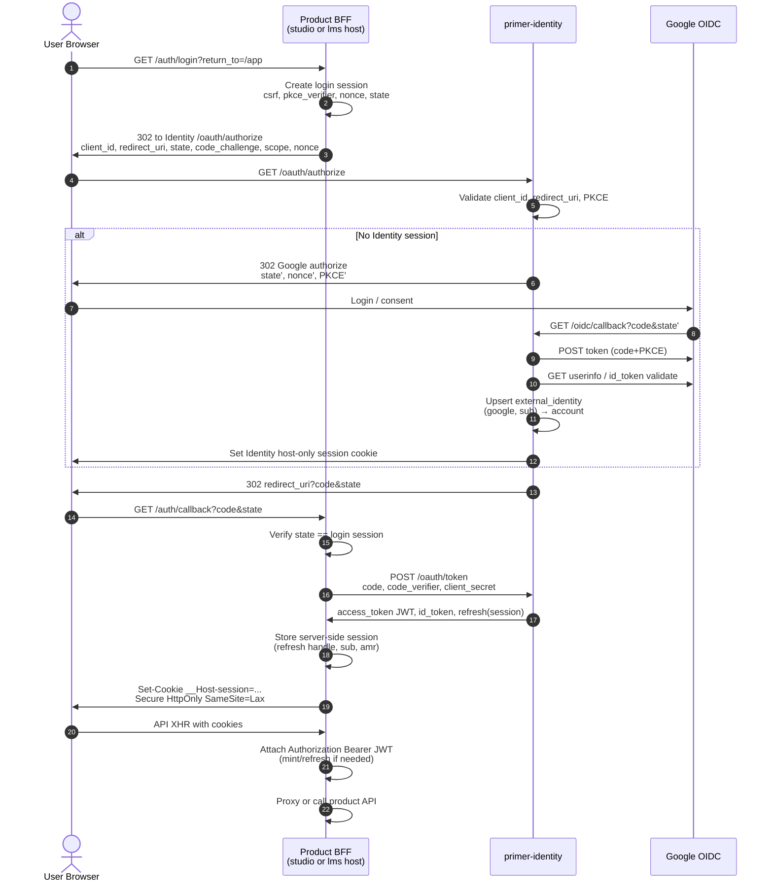
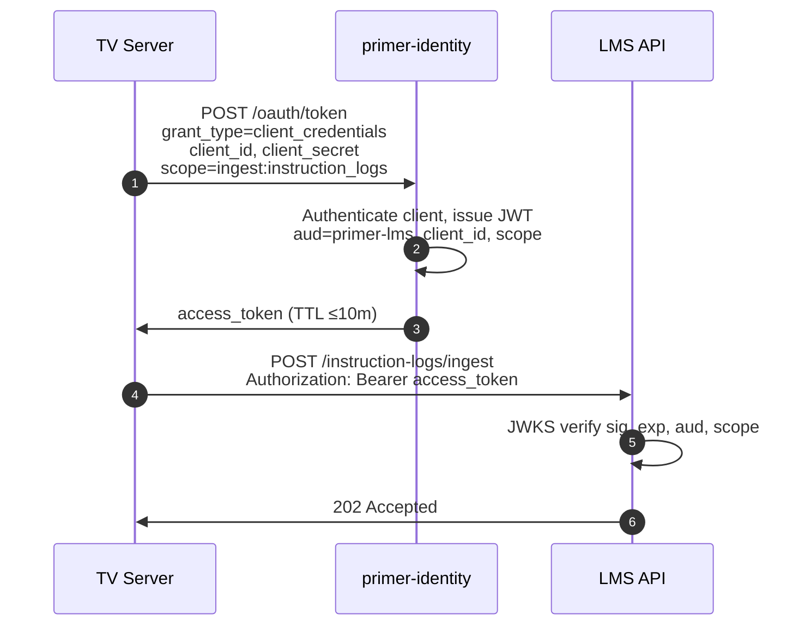
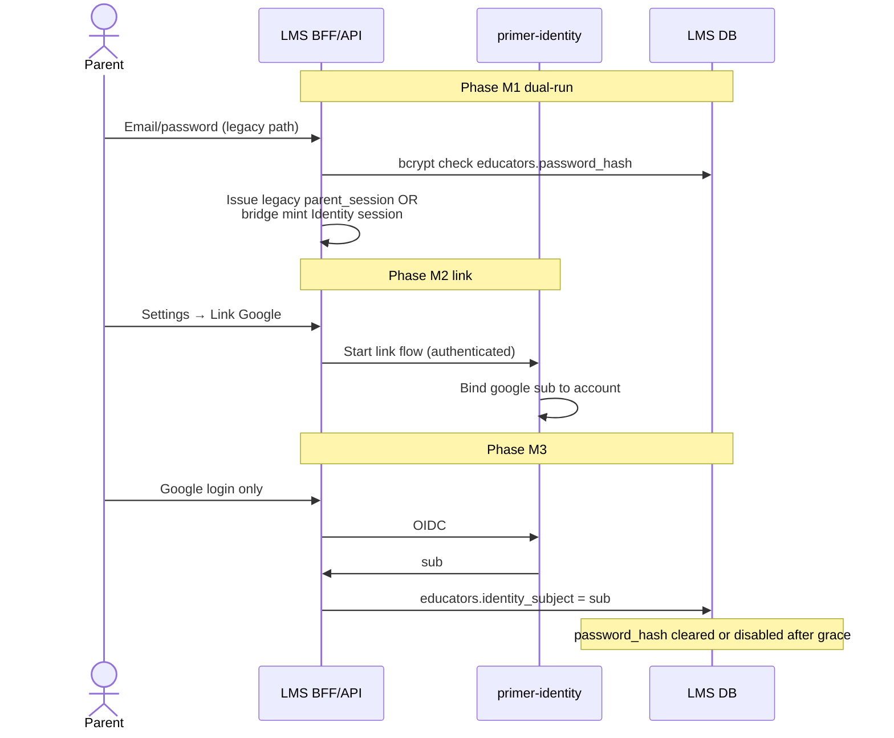

# Primer Identity Service Design

**Status:** Decision-complete foundational design
**Scope:** Independently deployable identity/auth service for Curriculum Studio and Primer LMS
**Not this document:** Full phased implementation plan, product authorization rules inside Studio/LMS, TV media device pairing redesign beyond scope boundaries
**Branch base:** `a1f1e90fded0fd810183e4eec18d3e1e95f3973a` (`planning/curriculum-studio-auth`)
**Coordinates with (read-only):** architecture `6768b4ed`, contracts `e1c80a3d`, DB `8c229caf`

---

## 1. Outcome

Introduce **Primer Identity** (`primer-identity`) as a separate, independently deployable service that:

1. Authenticates humans (Google OIDC primary; password migration path for existing Primer educators).
2. Issues short-lived, audience-bound access tokens and host-scoped browser sessions.
3. Issues and rotates machine credentials that replace static shared secrets (`SERVICE_TOKEN`, `X-Service-Token`, TV `X-Admin-Key` for *human-operated admin* migration path).
4. Owns accounts, external identity links, sessions, signing keys, and auth audit — **not** product authorization (workspace roles, student access, TV catalog grants).

Curriculum Studio and Primer LMS remain authorization owners. They validate identity tokens and map `sub` → local projections (`workspace_memberships.subject_ref`, LMS `educators`, etc.).

---

## 2. Current-state inventory (repository evidence)

| Surface | Today | Evidence |
| --- | --- | --- |
| LMS parent/educator login | Email + bcrypt password → opaque bearer session (12h), stored hashed in `parent_sessions` | `server/internal/api/auth_parent.go`, `server/internal/repo/parent_auth.go`, migration `00003_learning_activities.sql` |
| LMS admin SPA | Bearer token in `localStorage` (`primer-parent-token`); optional `VITE_PARENT_TOKEN` | `web/src/api/auth.ts`, `web/src/components/parent-token-gate.tsx` |
| LMS service ingest | Static `SERVICE_TOKEN`; accepted as `X-Service-Token` **or** `Authorization: Bearer` via `SharedSecretGuard` | `server/internal/api/secret.go`, `server/internal/config/config.go` |
| Student device | Opaque device token (Bearer / `X-Device-Token`); pairing codes; product-local | `server/internal/api/student_api.go`, `server/internal/authutil` |
| TV admin | Static `TV_ADMIN_API_KEY` as `X-Admin-Key`; SPA stores key in `localStorage` | `server/internal/tv/api/auth.go`, `tv-web/src/api/auth.ts` |
| TV device | Opaque device bearer after pairing; product-local | `server/internal/tv/auth`, `server/internal/tv/api/auth.go` |
| TV → LMS | `X-Service-Token` = LMS `SERVICE_TOKEN` | `server/internal/tv/primer/primer.go` |
| Studio contracts | Bearer JWT end-state; `X-Service-Token` migration-only | `curriculum-studio/contracts/README.md`, OpenAPI `bearerAuth` + `serviceCredential` |
| Studio DB | `workspace_memberships.subject_ref` opaque; no credentials | `curriculum-studio/db/migrations/00001_identity_and_catalogs.sql` |
| LikeC4 | `identity_service` adjacent with `#uncertainty` on every auth edge | `architecture/curriculum-studio/relationships/actors-auth.c4` |

**Gaps this design closes**

- No Google login.
- Browser tokens in `localStorage` (XSS-exfiltratable).
- Static shared secrets with fail-open when empty.
- No unified human subject across Studio and LMS.
- No JWKS, rotation, revocation, or CSRF-hardened browser flow.
- Studio cannot ship standalone without inventing local accounts or depending on live LMS sessions.

---

## 3. Trust and domain boundaries

```text
┌──────────────────────────────────────────────────────────────────────┐
│ Browser origins (host-only cookies; no parent-domain session cookie) │
│  studio.example.com │ lms.example.com │ identity.example.com         │
└───────────┬──────────────────┬─────────────────────┬─────────────────┘
            │ BFF cookie       │ BFF cookie          │ IdP cookies
            ▼                  ▼                     ▼
     Studio BFF/API      LMS BFF/API          primer-identity
            │                  │                     │
            │  JWT (aud=…)     │  JWT (aud=…)        │ owns accounts,
            │  local JWKS      │  local JWKS         │ sessions, keys
            ▼                  ▼                     ▼
     Studio Postgres      LMS Postgres         Identity Postgres
     (authz only)         (authz + product)    (identity only)
```

### Decided boundaries

| Boundary | Decision |
| --- | --- |
| Identity service owns | Accounts, external identities (`provider`+`sub`), human sessions, refresh/session store, signing keys/JWKS, OAuth client registrations, service principals + credentials, auth audit, break-glass recovery codes |
| Identity does **not** own | Studio workspace roles, LMS educator roles, student records, mastery, TV catalog grants, device pairing, curriculum data |
| Products own | Authorization after authenticating `sub` / `client_id` against local projections |
| Data isolation | Identity has its **own PostgreSQL**. No FKs/FDW into LMS or Studio DBs. Products store only opaque `subject_ref` / `educator.identity_subject` |
| Cookie scope | **Host-only** cookies per origin. **No** `Domain=.example.com` session cookie |
| Cross-product SSO | Same Identity account; **separate** browser sessions per product BFF (studio vs lms). Optional “continue as” after Google without a shared cookie jar across products |
| Email | Display and recovery contact only. **Never** the stable external key. **No auto-link by email** |

### Trust zones

1. **Public browser** — untrusted; only receives HttpOnly cookies from its own host BFF / Identity UI.
2. **Product BFF** — confidential client; holds session cookie ↔ access token mapping; never exposes refresh tokens to JS.
3. **Product API** — validates JWT locally via JWKS; enforces product authz.
4. **Identity** — sole password/OIDC token exchange; sole key material for access tokens.
5. **Service mesh / private network** — service credentials used server-to-server; not embedded in SPAs.

---

## 4. Decision table

| ID | Topic | Decision | Rationale | Alternatives rejected |
| --- | --- | --- | --- | --- |
| D1 | Deployable unit | Separate `primer-identity` service + DB | Studio must work without LMS; LMS must migrate without blocking Studio; matches LikeC4 adjacent IdP | Auth inside Studio only; auth only inside LMS |
| D2 | Human protocol | OAuth 2.1-aligned Authorization Code + PKCE for Google; Identity is OIDC RP to Google and OIDC OP to products | Current best practice ([OAuth 2.1 draft](https://datatracker.ietf.org/doc/html/draft-ietf-oauth-v2-1-13), [OIDC Core](https://openid.net/specs/openid-connect-core-1_0.html), [RFC 9700](https://www.rfc-editor.org/rfc/rfc9700.html)) | Implicit flow; resource-owner password; SPA direct Google with token in JS |
| D3 | Browser pattern | **BFF session**: product origin sets host-only session cookie; BFF obtains/attaches access tokens | Stops JWT/refresh in `localStorage`; CSRF controllable; aligns with [OAuth 2.0 for Browser-Based Apps](https://datatracker.ietf.org/doc/html/draft-ietf-oauth-browser-based-apps) BFF profile | SPA stores tokens; cross-subdomain SSO cookie |
| D4 | Access token | Signed JWT (JWS), short TTL (≤15m), explicit `aud`, minimal claims | Local verification at Studio/LMS without chatty introspection on hot path | Opaque tokens only (forces introspection dependency); long-lived JWT |
| D5 | Refresh | Server-side session / refresh **only on BFF or Identity**; never to browser JS | No token persistence in SPA unless required — and it is not | Refresh token in localStorage |
| D6 | Service auth | OAuth 2.0 client credentials (RFC 6749 §4.4) → JWT `aud` + `client_id` + scopes; replace static shared secrets | Rotation, audience binding, audit; closes fail-open empty secret | Long-lived static `SERVICE_TOKEN` forever |
| D7 | Header presentation | Humans: `Authorization: Bearer <access_jwt>`. Services: prefer `Authorization: Bearer <access_jwt>`; accept `X-Service-Token` **only** during migration as alias for the same JWT or a one-time migrating secret | Reconciles contracts dual scheme with a single credential type long-term | Parallel permanent dual credential systems |
| D8 | Stable subject | Internal UUID `sub`. External: `(provider, provider_subject)` unique. Email not a join key | Prevents account takeover via email collision at Google/IdP | Auto-link on verified email |
| D9 | Account linking | Explicit user-driven link while authenticated; step-up reauth required | Safe migration from password educators | Silent email merge |
| D10 | Studio membership | Studio keeps `workspace_memberships`; Identity may emit membership-hint events but Studio is SoT for roles | Product plan + DB schema already separate authz projections | Identity stores Studio roles |
| D11 | LMS educators | LMS keeps `educators` row as product principal; adds `identity_subject` FK-less text link | Preserves student/enrollment FKs; no identity DB coupling | Move educators table into Identity |
| D12 | Students | Students are **not** Identity interactive users in v1 | Product plan Phase 1 avoids student accounts; device tokens stay product-local | Student Google login now |
| D13 | TV admin | Migrate human TV admin SPA to LMS/Identity session (BFF) with product role `tv_admin`; retire browser-held `X-Admin-Key` | Shared secret in localStorage is not an identity | Keep static admin key forever for humans |
| D14 | TV / student devices | Remain **product-issued opaque device tokens**; not Identity access tokens | Different threat model (pairing, revoke-per-device, no browser) | Device tokens as JWTs from Identity |
| D15 | Cookies | `Secure; HttpOnly; SameSite=Lax` (or `Strict` where flow allows); **host-only**; `__Host-` prefix where path allows | CSRF + XSS hardening; no broad Domain cookie | `SameSite=None` cross-site session; parent domain cookie |
| D16 | CSRF | SameSite + double-submit or synchronizer token on state-changing BFF routes; OAuth `state` bound to session | Login CSRF and session riding defenses | Rely on Bearer-only from SPA without cookie |
| D17 | Google binding | `state`, OIDC `nonce`, PKCE S256, exact redirect URI allowlist, optional DPoP later (deferred) | Callback replay and code interception resistance ([RFC 7636](https://www.rfc-editor.org/rfc/rfc7636), OIDC Core) | state-only without PKCE |
| D18 | Key rotation | JWKS with overlapping keys; `kid` on every JWT; dual-key accept window | Avoid outage on rotate | Single static HS256 shared secret |
| D19 | Logout | Server-side session revoke + cookie clear; optional Google RP-initiated logout deferred; access JWT remains until expiry ≤15m or denylist on critical revoke | Fail-closed session; short JWT limits window | Fail-open “best effort” logout |
| D20 | Break-glass | Hardware-backed recovery codes + break-glass password accounts disabled by default; audited | Ops recovery without email auto-link | Shared root password in env only |

---

## 5. Actors and credential types

| Actor | Credential | Issuer | Consumer |
| --- | --- | --- | --- |
| Studio author (teacher/parent/curriculum author) | Host-only BFF session → JWT `aud=curriculum-studio` | Identity via Studio BFF | Studio API |
| Curriculum-planning MCP agent (user-delegated) | Bearer access JWT `aud=curriculum-studio` (and scopes such as `studio:mcp` / `studio:read` / `studio:draft` / `studio:publish` as registered) obtained via Identity OAuth / protected-resource flow required by the MCP client | Identity (AS); Studio may advertise protected-resource metadata pointing at Identity | Studio MCP `/mcp` (validates JWT; **never** mints tokens) |
| LMS parent / admin | Host-only BFF session → JWT `aud=primer-lms` | Identity via LMS BFF | LMS API |
| LMS service caller (TV server, future jobs) | Client-credentials JWT `aud=primer-lms`, scope e.g. `ingest:instruction_logs` | Identity | LMS API |
| Studio service caller (Primer materialize) | Client-credentials JWT `aud=curriculum-studio`, scope e.g. `materialize:write` | Identity | Studio API / gRPC |
| Studio MCP service principal (optional automation) | Client-credentials JWT `aud=curriculum-studio`, MCP scopes; still subject to Studio workspace authz projections | Identity | Studio MCP `/mcp` |
| TV admin human | Same as LMS admin session with LMS authz role (or dedicated `aud` only if TV stays separate admin host — see deferred) | Identity | TV admin API via BFF |
| TV device | Opaque device token | TV service | TV device API |
| Student workstation | Opaque device token | LMS | LMS student API |
| Break-glass operator | Recovery code / break-glass IdP | Identity | Identity admin only |

---

## 6. OAuth 2.1 / OIDC flows

### 6.1 Google login (human) — Authorization Code + PKCE via product BFF

Identity is the **only** Google OAuth client. Product BFFs are OIDC clients of Identity (not of Google directly). This keeps one Google brand config and one place for account linking.



**Hard requirements**

- `redirect_uri` exact match allowlist per client.
- `state` cryptographically random, single-use, bound to BFF login session cookie (pre-auth).
- PKCE S256 mandatory for public and confidential browser-started flows ([OAuth 2.1](https://datatracker.ietf.org/doc/html/draft-ietf-oauth-v2-1-13)).
- OIDC `nonce` in ID token must match.
- `return_to` allowlist (relative paths only on product origin) — block open redirects.
- Authorization codes single-use, short TTL (≤2 minutes).
- Identity session cookie is **host-only on identity origin**; product session cookie is **host-only on product origin**. No shared parent domain.

### 6.2 Service-to-service — Client credentials



Migration alias (temporary): LMS `SharedSecretGuard` accepts legacy `X-Service-Token: <static>` **or** Bearer JWT. Static path removed after all callers migrate (see §15).

### 6.3 Token mint for BFF (confidential client)

Product BFFs register as confidential OIDC clients:

| Client ID (example) | redirect_uri hosts | Allowed `aud` down-stream |
| --- | --- | --- |
| `studio-bff` | `https://studio.example.com/auth/callback` | `curriculum-studio` |
| `lms-bff` | `https://lms.example.com/auth/callback` | `primer-lms` |
| `tv-admin-bff` | `https://tv-admin.example.com/auth/callback` (if separate host) | `primer-tv-admin` **or** `primer-lms` with role check |

---

## 7. Browser / BFF session pattern and cookie scope

### Decided cookie map

| Cookie | Host | Flags | Contents |
| --- | --- | --- | --- |
| `__Host-bff_session` | Product host only | `Secure; HttpOnly; Path=/; SameSite=Lax` | Opaque session id (lookup server-side) |
| `__Host-login` | Product host only | same | Short-lived login CSRF/state binder |
| `__Host-id_session` | Identity host only | same | Identity SSO session (optional convenience for re-consent) |

**Forbidden:** `Domain=example.com`, non-Host cookies holding JWTs, access tokens in `localStorage`/`sessionStorage` for production SPAs.

### BFF responsibilities

1. Run OAuth code exchange with client secret (or mTLS — deferred).
2. Persist refresh/session server-side (Redis or Identity session store via refresh token **not** readable by JS).
3. On each API call: ensure fresh access JWT; inject `Authorization: Bearer`.
4. Enforce CSRF on cookie-authenticated mutating requests (`SameSite=Lax` + CSRF header token for non-safe methods).
5. Never log tokens; never put tokens in URL query after callback (use POST form or server-side exchange only).

### SPA changes from today

| Today | Target |
| --- | --- |
| LMS: Bearer from `localStorage` | Cookie session; SPA calls same-origin `/api/*`; no token in JS |
| TV admin: `X-Admin-Key` in `localStorage` | Same BFF cookie session; admin authz in LMS/TV API |
| Manual token paste gate | Login redirect button |

---

## 8. Access token format, audiences, claims

### 8.1 Profile

- **JWS** compact serialization, algorithm **ES256** (P-256) preferred; RS256 acceptable if ops tooling requires.
- Header: `{"alg":"ES256","typ":"at+jwt","kid":"..."}` ([RFC 9068](https://www.rfc-editor.org/rfc/rfc9068.html) access token profile guidance).
- TTL: human **5–15 minutes**; service **5–10 minutes**.
- Not encrypted (JWE deferred). Transport is TLS.

### 8.2 Required claims

| Claim | Human access token | Service access token |
| --- | --- | --- |
| `iss` | `https://identity.example.com/` (stable issuer URL) | same |
| `sub` | Account UUID | Service principal UUID **or** stable `client_id` as `sub` (pick one; **decided:** `sub` = service principal UUID, `client_id` claim separate) |
| `aud` | Single audience string: `curriculum-studio` **or** `primer-lms` **or** `primer-tv-admin` | Single audience of target API |
| `exp` / `iat` / `nbf` | required | required |
| `jti` | required (revoke/denylist key) | required |
| `auth_time` | required | omit |
| `amr` | e.g. `["oidc","pwd"]` | `["client_secret"]` |
| `azp` / `client_id` | BFF client id | service client id |
| `scope` | space-separated granted scopes | space-separated |
| `email` | **omit by default** (privacy); products fetch via userinfo if needed | omit |
| `email_verified` | omit from access token | omit |
| `roles` | **omit** — product authz only | omit |
| `workspace_ids` | **omit** from default access token | omit |
| `sid` | Identity session id (for logout correlation) | omit |

**Audience confusion control:** validators **must** require exact `aud` match for their service. A Studio JWT is rejected by LMS and vice versa. No multi-audience access tokens in v1.

### 8.3 Scopes (non-authorization roles)

Scopes are coarse API capabilities, not Studio workspace roles:

| Scope | Meaning |
| --- | --- |
| `openid` | OIDC |
| `profile` | display name via userinfo |
| `offline_access` | BFF refresh (confidential only) |
| `studio:api` | call Studio authoring API (authz still local) |
| `studio:mcp` | connect to Studio MCP `/mcp` (tools/list baseline) |
| `studio:read` | MCP/API read tools (discovery, search, graph read, findings) |
| `studio:draft` | MCP/API draft mutations (create draft, patch graph, validate) |
| `studio:publish` | MCP/API publish proposal/confirm eligibility (Studio still enforces human step-up + roles) |
| `lms:api` | call LMS parent API |
| `ingest:instruction_logs` | LMS ingest |
| `studio:materialize` | Studio integration materialize |
| `identity:link` | manage own external links |

Workspace role checks (`owner|admin|author|…`) remain in Studio using `sub` → `workspace_memberships`.
MCP tools re-check membership **and** scopes on every call; JWT never carries workspace roles.

### 8.3.1 MCP clients, protected resource, and delegation

Curriculum Studio MCP (`/mcp`) is a **resource** of audience `curriculum-studio`, not an authorization server.

| Concern | Owner |
| --- | --- |
| Authorization server (authorize/token/JWKS/revoke) | **Identity** |
| OAuth client registration for MCP clients (public/confidential as required by the MCP client) | **Identity** |
| Protected-resource metadata for `https://<studio>/mcp` (points clients at Identity AS; advertises resource/audiences) | **Studio may host resource metadata**; **Identity** remains AS |
| Access token mint + refresh + revocation | **Identity** |
| Tool authorization / workspace RBAC / opaque handle checks | **Studio** (never Identity) |
| User delegation to an agent | User authenticates to Identity; agent presents user-delegated or service token with MCP scopes; Studio maps `sub` → `subject_ref` |

**Revocation:** short access TTL; `jti` denylist / session revoke on Identity side; Studio validates every MCP HTTP request (stateless — no MCP protocol session to revoke). Service principal credential rotation follows §10.

See also: [`curriculum-studio-mcp-design.md`](./curriculum-studio-mcp-design.md).

### 8.4 UserInfo and account API

`GET /v1/userinfo` (OAuth bearer) returns profile claims. Products should not stuff PII into JWTs.

---

## 9. JWKS and key rotation

### Endpoints

- `GET / exwell-known/openid-configuration`
- `GET /oauth/jwks` (or `jwks_uri` from discovery) — public keys only

### Rotation procedure (decided)

1. Generate new keypair; insert as `next` with new `kid`.
2. Publish both keys on JWKS **before** signing with new key (propagate ≥2× cache TTL).
3. Switch signer to new `kid`.
4. Keep old key on JWKS until max access-token TTL + clock skew window expires.
5. Retire old key.
6. Emergency revoke: remove `kid` from JWKS **and** push denylist of outstanding `jti` if TTL window is unacceptable; prefer short TTL to make this rare.

### Failure mode: rotation outage

- Products cache JWKS with bounded TTL (e.g. 5–15m) and **must** refetch on unknown `kid` (reactive).
- Identity health check fails if active signer not present in published JWKS.
- Never delete last verification key while tokens with that `kid` may still be unexpired.

### Algorithm policy

- Reject `alg=none`.
- Pin allowed algs on validators.
- No HS256 shared secret for cross-service access tokens (avoids secret distribution and confusion with legacy `SERVICE_TOKEN`).

---

## 10. Service-to-service auth replacing static shared secrets

### Target model

| Legacy | Replacement |
| --- | --- |
| LMS `SERVICE_TOKEN` / `X-Service-Token` | Client `tv-server` (etc.) client-credentials JWT `aud=primer-lms` |
| TV `TV_ADMIN_API_KEY` for **machines** (overseer agents) | Service client with scopes for TV admin API **or** LMS-mediated calls |
| TV `TV_ADMIN_API_KEY` for **humans** in SPA | Human BFF session (§5, D13) |
| Contracts `serviceCredential` header | Same JWT; header alias during migration |

### Service principal store (Identity DB)

- `service_principals(id, client_id, name, status, created_at)`
- `service_credentials(id, principal_id, secret_hash, kid/label, expires_at, revoked_at)` — bcrypt/argon2id or HMAC-hashed secrets
- `service_grants(principal_id, audience, scopes[])`

Secrets shown once at mint; rotation issues new secret and revokes old after grace.

### LMS / Studio validator behavior

```text
1. Extract Bearer token (preferred).
2. If JWT shape → JWKS verify → enforce aud, exp, scope.
3. Else if migration mode && X-Service-Token / Bearer equals legacy static → accept with dual-write metric + warning logs.
4. Else 401.
5. Empty legacy secret in production → process refuse to start (flip fail-open to fail-closed).
```

---

## 11. Account model, linking, and password migration

### 11.1 Identity entities (Identity DB only)

```text
accounts
  id (uuid, sub)
  status (active|locked|pending_deletion)
  display_name
  primary_email (nullable, not unique-enforced as login key)
  primary_email_verified_at
  created_at, updated_at

external_identities
  id
  account_id
  provider  -- 'google' | 'password' | 'breakglass'
  provider_subject  -- Google sub; for password: account_id or stable random
  UNIQUE (provider, provider_subject)

credentials_password
  account_id
  password_hash (argon2id)
  algorithm
  rotated_at
  disabled_at

auth_sessions
  id (sid)
  account_id
  client_id
  amr
  ip_hash, user_agent_hash
  created_at, expires_at, revoked_at

auth_codes, refresh_sessions, jti_denylist (or session-centric revoke)
signing_keys
audit_events
recovery_codes
oauth_clients
service_principals / credentials / grants
```

**Stable external key:** `(provider, provider_subject)`.
**Stable internal key:** `accounts.id` as JWT `sub`.

### 11.2 No auto-link by email

On Google login:

1. Find `external_identities` where `provider='google' AND provider_subject=google_sub`.
2. If found → login as that account.
3. If not found → **create new account** linked only to that Google subject.
4. If Google email matches an existing password account’s email → **do not merge**. Offer authenticated linking UX later:
   - User signs in with password session, then “Link Google” (step-up).
   - Or signs in with Google, then “Link password login” by proving password.
5. Unverified email never proposes link.

### 11.3 Migrating existing Primer educators



**LMS schema additive (product DB, not Identity):**

- `educators.identity_subject TEXT UNIQUE` (nullable during migration)
- Keep `password_hash` until migration complete; then disable password check path
- Map `sub` → educator on each request after JWT validate; if missing educator row, provisioning policy:
  - **Decided default:** no silent auto-provision admin; allow self-provision only if deployment flag `LMS_ALLOW_JUST_IN_TIME_PARENT=true` for single-family installs; multi-tenant later requires invite

**Lockout prevention**

- Until an educator has at least one usable factor (password still enabled **or** linked Google **or** recovery), do not disable password.
- Migration job reports educators with password-only, Google-only, unlinked.
- Break-glass admin can unlock and attach factor without email auto-merge.

### 11.4 Curriculum Studio authors

- First Google login creates Identity account.
- Studio creates/links `workspace_memberships.subject_ref = "identity:" + sub` (format decided: `identity:<uuid>`).
- Invites: Studio stores invited email as **invite**, not as subject; on accept, bind to `sub` after login (explicit).

---

## 12. Studio workspace membership projections

| Concern | Owner |
| --- | --- |
| Who may log in | Identity |
| Which workspaces / roles | Studio DB `workspace_memberships` |
| Tenant isolation | Studio `tenants` / `workspaces` |
| Service membership | Studio may record `subject_kind=service` with `subject_ref=identity:svc:<id>` for audit; authz still scope+local |

**Optional event (Identity → Studio):** `identity.account.created`, `identity.session.revoked` — Studio may mark memberships stale; **must not** grant roles from events alone without invite/accept flow.

**Reconcile with DB artifact:** `subject_ref` remains opaque text; prefer prefix convention `identity:<uuid>` documented in Studio SCHEMA — requires DB/docs note (see §17).

---

## 13. Primer educator / parent / student implications

| Principal | Identity? | Notes |
| --- | --- | --- |
| Parent / admin educator | Yes | Primary human LMS user |
| Tutor role educator | Yes if human login needed | Same account model; LMS role stays on `educators.role` |
| Student | No (v1) | Continue device pairing; future student IdP is deferred |
| Learning sessions | No | Product data |
| Single-family deployment | Yes | One Identity; JIT parent flag optional |

ParentSessionGuard today checks `role in (parent, admin)`. After migration, guard becomes:

1. Verify JWT `aud=primer-lms`.
2. Resolve educator by `identity_subject`.
3. Enforce role in LMS.

---

## 14. TV admin versus TV device-token scope

| Path | Authn | Authz |
| --- | --- | --- |
| TV admin SPA (human) | Identity → TV-admin or LMS BFF session | Product roles: manage catalog, pairing codes, schedules |
| Overseer/tutor automation | Service client JWT `aud=primer-tv-admin` or `primer-lms` with TV scopes | Least-privilege scopes |
| TV device app | **TV-local** opaque device token after pairing | Device row grants; not an Identity user |
| TV → LMS ingest | Service client JWT replacing shared `PRIMER_SERVICE_TOKEN` | `ingest:instruction_logs` |

Device tokens must never be accepted as human admin credentials. Admin routes and device routes stay on distinct guards (as today).

---

## 15. Logout, revocation, session lifecycle

### Lifecycle

| Object | TTL | Revocation |
| --- | --- | --- |
| Login `state` / auth code | minutes | single-use |
| BFF server session | 12h idle sliding or 24h absolute (align near today’s 12h parent session) | logout, password change, admin revoke, risk engine |
| Identity SSO session | ≤24h absolute | logout, revoke-all |
| Access JWT | ≤15m | natural expiry; denylist `jti`/`sid` on security events |
| Refresh / session handle | bound to server session | rotate on use (refresh token rotation) |
| Service secret | 90d recommended | rotate; dual-valid grace ≤7d |
| Device tokens | product policy | product revoke |

### Logout sequence

```mermaid
sequenceDiagram
    actor U as User
    participant BFF as Product BFF
    participant ID as primer-identity

    U->>BFF: POST /auth/logout (+ CSRF)
    BFF->>BFF: Delete server session
    BFF->>U: Clear-Site-Data / expire __Host-bff_session
    BFF->>ID: POST /oauth/revoke (refresh/sid) [required if refresh exists]
    ID->>ID: revoked_at = now on session
    opt Global logout
        BFF->>ID: POST /logout (RP-initiated)
        ID->>ID: Revoke all sessions for account+client or account-wide
    end
    Note over BFF: Fail-closed: local session cleared even if Identity revoke fails;<br/>retry revoke async; metric+alert on Identity failure
```

**Fail-closed rules**

- Missing/invalid session → treat as logged out (200 on logout idempotent).
- API calls with revoked session → 401.
- Do not keep serving cookie if server session row gone.
- Access JWT may work until `exp` unless denylist checked (required for `revoke-all` and account lock).

### Account lock

Sets `accounts.status=locked`, revokes all sessions, denylists by `sid`, rejects new tokens.

---

## 16. CSRF, Google state/nonce/PKCE, browser binding

| Attack | Control |
| --- | --- |
| Login CSRF | `state` bound to pre-login cookie; reject mismatched/missing |
| Callback replay | one-time code; PKCE; short code TTL |
| Code interception | PKCE S256; TLS; no codes in referrer (redirect to BFF without leaking to third parties) |
| Session CSRF | `SameSite=Lax` + CSRF token header on mutating BFF/API cookie routes |
| Token XSS theft | HttpOnly cookies; no tokens in JS |
| Open redirect | allowlisted `return_to` |
| Mix-up / audience confusion | strict `aud`; distinct client_ids; validate `iss` |
| Redirect-follow secret exfiltration | secrets only in POST body to token endpoint; never in query; SSRF-safe webhook allowlists elsewhere |
| Cookie fixation | new session id at login; regenerate on privilege change |

**Browser binding (v1 decided):** session bound to hashed user-agent + optional IP prefix signal for anomaly alerts; hard bind deferred (risk of mobile false positives). **DPoP / mTLS for BFFs deferred.**

---

## 17. Token persistence policy

| Location | Allowed? |
| --- | --- |
| Browser JS memory / storage | **No** access or refresh tokens |
| Product BFF server memory/DB | Yes — session + refresh handle |
| Identity DB | Yes — sessions, codes, hashed secrets |
| Device local store (TV/student) | Yes — product device token only |
| Logs / metrics / OTel attributes | **No** raw tokens; hash or jti only |
| CI / `.env` examples | Placeholder only; production secrets in secret manager |

---

## 18. Break-glass and recovery

1. **Recovery codes:** generated at account security setup; hashed at rest; one-time; re-issue invalidates old set.
2. **Break-glass operators:** separate `provider=breakglass` principals; hardware key or stored offline codes; every use pages on-call and writes immutable audit.
3. **Disabled Google / IdP outage:** password path remains for migrated users who still have password enabled; pure-Google users use recovery codes.
4. **Identity DB restore:** signing keys from HSM/secret manager backup; session table loss logs everyone out (acceptable).
5. **No** shared infinite `SERVICE_TOKEN` as break-glass for product APIs once migration completes — use break-glass human + short-lived mint tooling.

---

## 19. Identity service data ownership

### Owns (separate PostgreSQL)

Accounts, external identities, passwords, recovery codes, OAuth clients, auth codes, sessions, refresh handles, JWKS key metadata (private keys in KMS/HSM or sealed at rest), service principals/credentials/grants, auth audit log, rate-limit buckets (or Redis).

### Does not own

Studio tenants/workspaces/memberships/plans; LMS educators/students/mastery; TV devices/media; artifact bytes.

### Redis (optional)

Session cache, rate limits, jti denylist — must be Identity-scoped, not shared with product caches.

---

## 20. APIs and events

### 20.1 Public / BFF-facing HTTP (Identity)

| Method | Path | Purpose |
| --- | --- | --- |
| GET | `/.well-known/openid-configuration` | Discovery |
| GET | `/oauth/jwks` | JWKS |
| GET | `/oauth/authorize` | Authorization endpoint |
| POST | `/oauth/token` | code / refresh / client_credentials |
| POST | `/oauth/revoke` | RFC 7009 |
| GET | `/v1/userinfo` | OIDC userinfo |
| POST | `/v1/logout` | RP logout / session end |
| GET/POST | `/v1/account/links` | list/start/confirm external link |
| POST | `/v1/account/recovery/verify` | recovery code |
| GET | `/healthz` | liveness (no auth) |
| GET | `/readyz` | DB + signer ready |

### 20.2 Admin API (Identity, highly restricted)

Client/app registration, service principal mint/rotate, account lock, session revoke-all, break-glass — mTLS or break-glass only; not product user JWT.

### 20.3 Product-facing verification

No required introspection hot path. Optional:

`POST /oauth/introspect` for non-JWT legacy during migration only.

### 20.4 Events (async, optional consumers)

| Event | Payload (minimal) | Consumers |
| --- | --- | --- |
| `identity.account.created` | `sub`, timestamp | Studio/LMS provisioning hooks |
| `identity.account.locked` | `sub` | revoke local sessions caches |
| `identity.session.revoked` | `sub`, `sid` | BFF session kill |
| `identity.external_identity.linked` | `sub`, provider | audit |
| `identity.client.secret_rotated` | `client_id` | ops |

Events are informational; **authorization must not solely trust event delivery**.

---

## 21. Deployment and availability

| Aspect | Decision |
| --- | --- |
| Process | Separate binary/container `primer-identity` |
| DB | Dedicated PostgreSQL (HA Patroni-class in prod) |
| KMS | Signing keys in KMS/HSM; app holds app-level DEK only if needed |
| Placement | Same private network as LMS/Studio; public only: authorize, callback, discovery, jwks, login UI |
| HA | ≥2 replicas behind LB; sticky sessions not required if session store is DB/Redis |
| RPO/RTO | Sessions loseable; accounts+keys critical — backup keys+accounts continuously |
| Dependencies | Google OIDC availability; degraded mode: password + recovery for users who have them |
| Config | Issuer URL, public base URL, client allowlists, Google client id/secret via secret manager |
| Local dev | Docker compose identity + seeded clients; optional Google test client or mocked OIDC |

---

## 22. Observability, audit, privacy

### Metrics

- login success/fail by client and provider
- token issue/refresh/revoke counts
- JWKS fetch errors at products
- legacy shared-secret acceptance count (must trend to 0)
- latency on `/oauth/token`

### Audit (Identity)

Immutable-ish `audit_events`: actor, action, target, ip_hash, ua_hash, outcome. Retain per policy (e.g. ≥1 year for auth).

### Privacy

- Minimize PII in JWTs and logs.
- Hash IPs/UAs at rest if full values not required.
- Google profile data retained only as needed for display.
- Data subject export/delete: Identity deletes/anonymizes account; emits `account.pending_deletion` so products unlink `subject_ref` per their retention policy.
- Students not in Identity reduces COPPA/FERPA surface for this service.

### Tracing

Propagate W3C trace context; never put tokens in span attributes.

---

## 23. Threat model (STRIDE-focused)

| Threat | Mitigation |
| --- | --- |
| Spoofing (fake Google) | Validate ID token `iss`/`aud`/sig via Google JWKS; PKCE; state |
| Tampering (JWT) | Asymmetric sig; pin alg; `kid` |
| Repudiation | Auth audit log |
| Info disclosure | HttpOnly; no tokens in logs; separate DBs |
| DoS | Rate limit authorize/token/login; captcha deferred |
| Elevation | No roles in JWT; product authz; audience separation |
| Account takeover via email | No auto-link |
| Stolen refresh | Rotation + server-side only + revoke |
| Stolen device token | Product revoke; not Identity session |
| SSRF on token endpoint | N/A browser; server clients use fixed Identity URL |
| Admin key leak in SPA | Eliminate static admin key for humans |
| Fail-open empty service secret | Production require secret or JWT-only mode |

### Security self-review checklist (this design)

| Control area | Status in design |
| --- | --- |
| Login CSRF | state + login cookie binder |
| Callback replay | one-time code + PKCE + short TTL |
| Token audience confusion | single `aud`, strict validate |
| Redirect-follow secret exfiltration | secrets POST-only; allowlisted redirects |
| Key rotation failure | dual-publish JWKS; unknown kid refetch; health on signer |
| Cross-tenant authz leakage | no tenant roles in Identity token; Studio/LMS enforce |
| Logout fail-open | local session always cleared; revoke retried |
| Migration lockout | password remains until alternate factor linked |

---

## 24. Phased migration compatibility and rollback

> This section is migration strategy only — not the full implementation plan.

| Stage | Compatibility | Rollback |
| --- | --- | --- |
| **S0 — Design freeze** | This document; sibling artifact reconciliations filed | N/A |
| **S1 — Identity deploy dark** | Discovery/JWKS live; no product traffic | Turn off service |
| **S2 — Studio Google login** | Studio BFF cookie auth; LMS unchanged | Studio feature flag back to unavailable / maintenance |
| **S3 — LMS dual login** | Password legacy **and** Google via Identity; `identity_subject` populated on link | Disable Identity path; password-only |
| **S4 — Service JWT dual-accept** | LMS/Studio accept JWT + legacy static | Re-enable static only |
| **S5 — SPA cookie cutover** | Remove localStorage bearer/admin key | Re-enable token paste gate (dev only) |
| **S6 — TV admin human SSO** | Replace admin key SPA | Restore `X-Admin-Key` path behind flag |
| **S7 — Disable legacy secrets & passwords** | JWT-only services; password optional/disabled per policy | Re-enable secrets only with incident approval + expiry |

**Rollback principle:** every stage keeps the previous authenticator valid until metrics show zero use and support signs off. Never disable password for an account without a second factor.

---

## 25. Reconciliations with sibling artifacts

**Applied** on `planning/curriculum-studio-integration` (see
`curriculum-studio-foundation-crosswalk.md`). Summary:

### 25.1 Architecture (LikeC4)

| Item | Status |
| --- | --- |
| `identity_service` | Decided external system; `#uncertainty` removed from auth edges |
| Relationships | Studio UI → OIDC/BFF; Studio API → JWKS only; LMS web/API → Identity migration target |
| Views | `auth_trust` is decided trust view |
| Remaining `#uncertainty` | Studio→LMS JSON import push adapter only |

### 25.2 Contracts

| Item | Status |
| --- | --- |
| Path | Relocated to `curriculum-studio/contracts/` |
| Auth README + OpenAPI | Bearer JWT end-state; `X-Service-Token` migration-only |
| gRPC | `authorization: Bearer` only |
| Item kinds | Union closed set aligned with DB |

**Dual presentation (frozen):**

1. `Authorization: Bearer <JWT>` (primary end-state),
2. `X-Service-Token: <JWT>` (alias, discouraged),
3. `X-Service-Token: <legacy static>` (temporary through S7).

### 25.3 DB (Studio)

| Item | Status |
| --- | --- |
| `subject_ref` | Documented `identity:<uuid>` / `identity:svc:<id>` |
| `integration_identities.system` | `primer_lms`, `primer_identity`, `oidc`, `other` |
| No credentials in Studio | Reaffirmed |
| Item kinds | Union with contracts |

### 25.4 LMS (this repo, future implementation)

| Item | Change (still future code) |
| --- | --- |
| `educators.identity_subject` | Additive column |
| Parent guard | JWT path |
| `SharedSecretGuard` | Dual-accept then fail-closed |
| SPA auth | BFF cookies |
| Startup | Refuse empty service auth in prod |

## 26. Decided vs deferred

### Decided now (blocking design)

- Separate Identity service + DB
- Google as primary interactive IdP via Identity
- OAuth 2.1 code + PKCE; Identity as OP to products
- BFF host-only cookies; no cross-subdomain session cookie
- JWT access tokens, single audience, ES256/RS256, JWKS rotation
- No email auto-link; provider+sub stable key
- Product-owned authorization
- Client-credentials for services; sunset static secrets
- Device tokens stay product-local
- Students not in Identity v1
- CSRF/state/nonce/PKCE controls above
- Migration dual-run and rollback stages S0–S7

### Deferred (explicitly open)

| Topic | Notes |
| --- | --- |
| Full multi-tenant LMS org model | Single-family first; org invites later |
| Student / child Google accounts | COPPA/parental consent design separate |
| Passkeys / WebAuthn | Additive factor later |
| DPoP / sender-constraining | After BFF stabilizes |
| mTLS service clients | Optional hardening |
| Google Workspace / HD enterprise login | Optional `hd` claim checks |
| SCIM provisioning | Not required for v1 |
| Identity admin UI polish | API-first OK |
| Exact production hostnames | env-specific |
| Whether TV admin shares `lms` host or separate `tv-admin` host | Both fit BFF pattern; pick at deploy |
| Refresh token storage: BFF DB vs Identity-only opaque reference | Either OK if not in browser |
| Exact session absolute/idle TTLs | Bounds given; tune with product |
| SIEM export format | Ops preference |
| Full phased engineering plan | Separate plan after acceptance |

---

## 27. Standards and references

- [OAuth 2.1 Draft](https://datatracker.ietf.org/doc/html/draft-ietf-oauth-v2-1-13)
- [RFC 6749](https://www.rfc-editor.org/rfc/rfc6749) OAuth 2.0
- [RFC 7636](https://www.rfc-editor.org/rfc/rfc7636) PKCE
- [RFC 7009](https://www.rfc-editor.org/rfc/rfc7009) Token Revocation
- [RFC 7519](https://www.rfc-editor.org/rfc/rfc7519) JWT
- [RFC 7517](https://www.rfc-editor.org/rfc/rfc7517) JWK
- [RFC 9068](https://www.rfc-editor.org/rfc/rfc9068) JWT Profile for Access Tokens
- [RFC 9700](https://www.rfc-editor.org/rfc/rfc9700) OAuth 2.0 Security Best Current Practice
- [OpenID Connect Core 1.0](https://openid.net/specs/openid-connect-core-1_0.html)
- [OAuth 2.0 for Browser-Based Apps (BFF)](https://datatracker.ietf.org/doc/html/draft-ietf-oauth-browser-based-apps)
- [OWASP Session Management Cheat Sheet](https://cheatsheetseries.owasp.org/cheatsheets/Session_Management_Cheat_Sheet.html)
- [OWASP CSRF Cheat Sheet](https://cheatsheetseries.owasp.org/cheatsheets/Cross-Site_Request_Forgery_Prevention_Cheat_Sheet.html)

---

## 28. Local links and source anchors

| Doc / code | Role |
| --- | --- |
| [primer-curriculum-studio-product-plan.md](./primer-curriculum-studio-product-plan.md) | Product boundary; Studio standalone |
| [AGENTS.md](../../AGENTS.md) | LMS/TV deployables, auth pointers |
| `server/internal/api/auth_parent.go` | Current parent login |
| `server/internal/api/secret.go` | SharedSecretGuard dual header |
| `server/internal/tv/api/auth.go` | TV admin key + device token |
| `web/src/api/auth.ts` | SPA bearer localStorage |
| `tv-web/src/api/auth.ts` | SPA admin key localStorage |
| Sibling architecture `architecture/curriculum-studio/**` | LikeC4 decided Identity edges |
| Foundation crosswalk | `curriculum-studio-foundation-crosswalk.md` | Authoritative vocabulary/ownership |
| Sibling `curriculum-studio/contracts/openapi/v1/curriculum-studio.yaml` | bearerAuth + serviceCredential |
| Sibling `curriculum-studio/db/migrations/00001_identity_and_catalogs.sql` | membership projections |

---

## 29. Acceptance of this design document

This foundational design is complete when:

1. Decisions D1–D20 are accepted or explicitly amended in a follow-up commit.
2. Sibling architecture/contracts/DB reconciliations (§25) are **applied** on the integration branch (crosswalk).
3. A later **implementation plan** can phase S1–S7 without re-opening boundary questions.
4. Security self-review table (§23) remains satisfied by the implementation plan’s test matrix.

---

## Appendix A — Claim example (informative)

```json
{
  "iss": "https://identity.example.com/",
  "sub": "a1b2c3d4-e5f6-7890-abcd-ef1234567890",
  "aud": "curriculum-studio",
  "exp": 1760000000,
  "iat": 1759999100,
  "nbf": 1759999100,
  "jti": "01J…",
  "client_id": "studio-bff",
  "scope": "openid studio:api",
  "amr": ["oidc"],
  "auth_time": 1759999000,
  "sid": "01J…"
}
```

## Appendix B — Validator pseudocode (product API)

```text
func Authorize(req):
  token = Bearer(req.Authorization) or MigrationServiceToken(req)
  if token empty: return 401
  if looks_like_jwt(token):
    hdr = parse_header(token)
    key = jwks.lookup(hdr.kid) or jwks.refetch_and_lookup(hdr.kid)
    claims = verify(token, key, algs={ES256,RS256}, iss=EXPECTED_ISS)
    require claims.aud == EXPECTED_AUD
    require claims.exp > now + skew
    if denylist.contains(claims.jti) or session_revoked(claims.sid): return 401
    principal = resolve_local(claims.sub)  // membership or educator
    if principal is nil: return 403 or 401 per product policy
    return authorize_product(principal, req)
  else if migration_static_enabled and constant_time_eq(token, legacy_secret):
    metric("legacy_service_secret_used")
    return authorize_service_legacy(req)
  return 401
```
