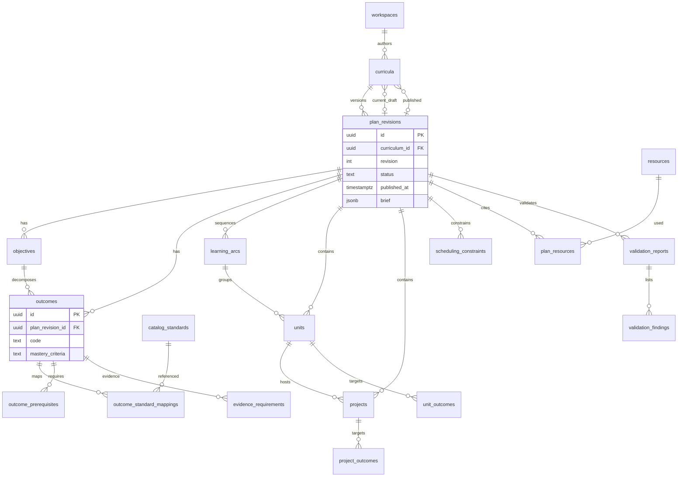
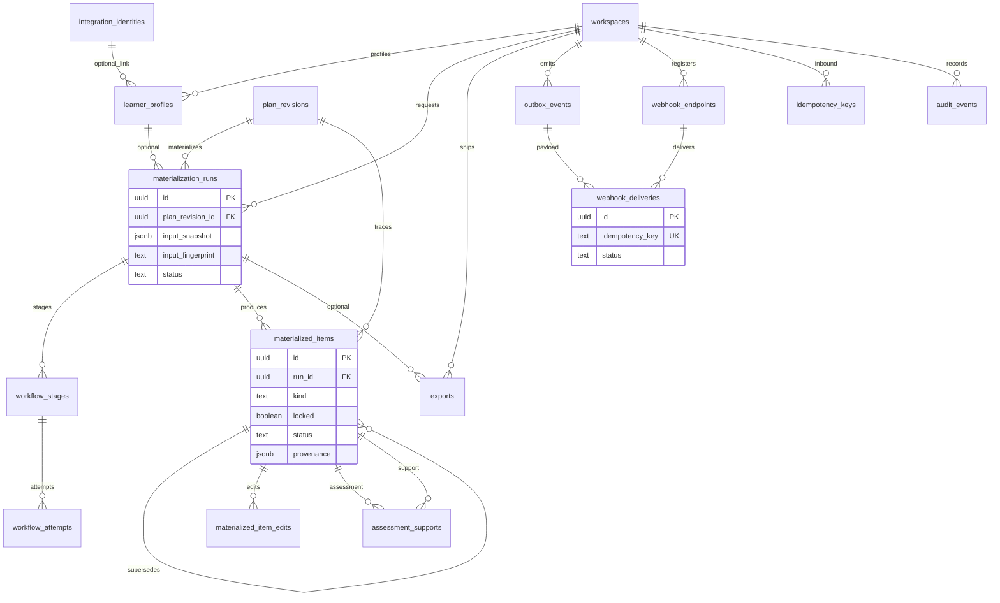

# Curriculum Studio ERD

All tables live in the `curriculum_studio` PostgreSQL schema. There are no
edges to Primer LMS or TV tables.

## Authorization and catalogs

```mermaid
erDiagram
    tenants ||--o{ workspaces : contains
    workspaces ||--o{ workspace_memberships : authorizes
    workspaces ||--o{ integration_identities : snapshots
    tenants ||--o{ resources : owns
    workspaces ||--o{ resources : optional
    workspaces ||--o{ standard_frameworks : custom
    standard_frameworks ||--o{ catalog_standards : contains
    catalog_standards ||--o{ catalog_standards : parent
    catalog_standards ||--o{ catalog_standard_prerequisites : requires
    catalog_standards ||--o{ standard_crosswalks : from
    catalog_standards ||--o{ standard_crosswalks : to

    tenants {
        uuid id PK
        text slug UK
        text status
    }
    workspaces {
        uuid id PK
        uuid tenant_id FK
        text slug
        text kind
    }
    workspace_memberships {
        uuid id PK
        uuid workspace_id FK
        text subject_ref
        text role
    }
    integration_identities {
        uuid id PK
        uuid workspace_id FK
        text system
        text external_kind
        text external_ref
        jsonb snapshot
    }
    standard_frameworks {
        uuid id PK
        uuid workspace_id FK
        text code
    }
    catalog_standards {
        uuid id PK
        uuid framework_id FK
        text code
    }
    resources {
        uuid id PK
        uuid tenant_id FK
        text kind
        text title
    }
```

## Plan graph



## Materialization, exports, events



## Isolation sketch

```text
┌─────────────────────────────┐     HTTP / events only      ┌──────────────────┐
│ Curriculum Studio database  │  ←  opaque subject_ref /    │ Primer LMS DB    │
│ schema curriculum_studio    │     external_ref snapshots  │ (separate)       │
└─────────────────────────────┘                             └──────────────────┘
              ▲
              │ no FK / view / FDW
              ▼
        ┌───────────┐
        │ TV DB     │
        └───────────┘
```

## Identity refs

`subject_ref` uses `identity:<uuid>` / `identity:svc:<id>`. `integration_identities.system` ∈ primer_lms, primer_identity, oidc, other. No edges to Identity or LMS databases.
